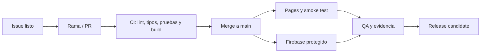

# Onirc — Release Candidate «Archivo de luz»

**Estado:** en ejecución
**Fuente de verdad:** `main` + GitHub Project «Onirc — Release Candidate / Archivo de luz»
**Objetivo:** una release candidate con identidad editorial, privacidad verificable, experiencia estable y evidencia de calidad.

## Regla de precedencia

La aplicación publicada no vuelve a promover el archivo público hasta que la proyección heredada haya sido retirada, migrada y verificada. La interfaz lo comunica como archivo en preparación; no sugiere una comunidad disponible ni expone identificadores internos.



Cada PR enlaza su issue, incluye evidencia visual y no llega a `main` sin los gates correspondientes. Pages se despliega después del merge. Firebase se despliega únicamente desde un entorno protegido mediante Workload Identity Federation; no se almacenan llaves privadas en GitHub.

## Fases y dependencias

| Orden | Fase / issue | Resultado verificable | Dependencia |
| --- | --- | --- | --- |
| P0 | Restablecer GitHub Pages verificable | El artefacto contiene `out/`, `/`, `/calendar/` y `/explorar/`; Pages publica el SHA actual. | — |
| P0 | Congelar y proteger el archivo público | La UI queda congelada, las reglas bloquean escrituras públicas desde clientes y ningún documento nuevo expone IDs internos. | — |
| A | Archivo de luz: sustracción y material | Una tensión visual por pantalla; Perla, Frost y Ópalo tienen usos claros y la navegación baja su volumen. | P0 Pages |
| B | Paisaje temporal: calendario y Perla | Estados vacío, único, múltiple, hoy, foco y selección forman una familia legible y táctil. | A |
| C | Cámara de memoria: Perla → Memoria y escritura | Entrada, retorno, composer, teclado y reduced motion conservan el contexto temporal. | B |
| D | Archivo abierto seguro y seudónimo | Función confiable, proyección sin IDs internos, retiro reversible, reporte y galería editorial. | P0 privacidad + A |
| E | Prueba de premio y release candidate | Recorridos funcionales, visuales, accesibles y de rendimiento sin defectos P0/P1. | Todas |

## Arquitectura de publicación acordada

```text
Memoria privada → publishDream() confiable → proyección pública segura
                     ↓
        referencia privada del propietario
```

La proyección pública sólo podrá contener título, narrativa, fecha, tono, firma seudónima y fecha de publicación. Nunca contiene UID, correo, `ownerId`, `sourceDreamId` ni rutas privadas. Editar la memoria privada no altera una publicación: volver a publicar es siempre una acción deliberada.

El despliegue de Functions queda pendiente de aprobación explícita para activar Firebase Blaze, configurar alertas y crear Workload Identity Federation. La cuota gratuita no sustituye un límite de gasto.

## Gates de calidad

Antes de una promoción a `main`:

- `npm run lint`
- `npm run typecheck`
- `npm run test`
- `npm run test:rules` con emulador Firestore y Java 21
- `npm run functions:lint && npm run functions:build`
- `CI=1 npm run test:e2e`
- `npm run build` con `ONIRC_BASE_PATH=/ONIRC`
- Comprobación explícita de `out/index.html`, `out/calendar/index.html` y `out/explorar/index.html`

Antes de declarar la release candidate:

- Recorridos en 320×568, 390×844, 768×1024, 1366×768, 1440×900 y 1920×1080.
- Teclado, foco visible, contraste, `axe`, reduced motion y consola limpia.
- Dos cuentas, visitante, publicación/retiro y migración sólo cuando la fase D esté autorizada.
- Capturas del inicio, calendario vacío/poblado, cámara de memoria, escritura y retorno.

## Criterio editorial

- Inicio: una promesa, una acción, un protagonista.
- Calendario: el tiempo está primero; la Perla representa una memoria, no un botón decorativo.
- Detalle: título, fecha, narrativa, acciones al final.
- Composer: escribir antes de clasificar; publicar sólo después de releer.
- Archivo abierto: placas estables, sin avatares, métricas, ranking ni scroll ansioso.
- Movimiento: continuidad, foco, profundidad, transformación o feedback; nada ornamental.

## Fuera de alcance de esta release candidate

IA, analítica, perfiles, seguidores, métricas de engagement, exportación y nuevas funciones que no mejoren el diario de sueños principal.
